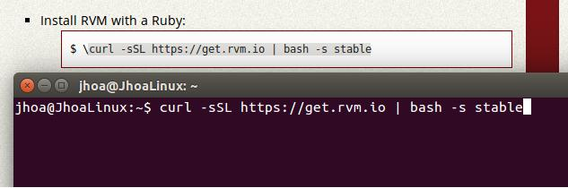
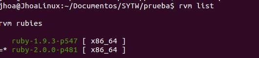
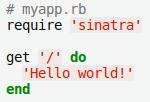

Tutorial - Instalacion RVM/RUBY
=========

* Instalar RVM
	1. Antes de instalar RVM necesitaremos instalar algunos paquetes:
>> ***$ sudo apt-get install build-essential git-core curl***
>

	2. Ahora instalaremos [RVM](http://rvm.io "RVM") , como nos indica en su pagina web

>> 
>
>> Podemos ver la version de RVM con el comando ***"rvm -v"***
>

* Instalar Ruby

	1. Con RVM podemos tener varias versiones de Ruby instaladas. Instalaremos la 2.0.0
	
>> ***$ rvm install 2.0.0***
>
>> Si tenemos varias versiones instaladas, con el comando ***[[$ rvm use ruby "NUM_VERSION" --default]]***  nos pasaremos a la version que queramos utilizar.
>
>> Con el comando ***[[$ rvm list]]*** veremos las versiones de Ruby instaladas
>
>> 
>

* Actualizar gemas

	1. ***$ gem update --system***
	2. ***$ gem sources -a http://gemcutter.org***

* Instalar gem Twitter.

	1. ***$ gem install twitter***

* Instalar y comprobar la gema Sinatra.

	1. ***$ gem install sinatra***
	2. Creamos el fichero "myapp.rb"
	
>> 
>

    3. Ejecutamos ***[[$ ruby myapp.rb]]*** y pruebo en el navegador: ***[[http://localhost:4567]]***

>> 
>

Jhoanmary Prz Fariña